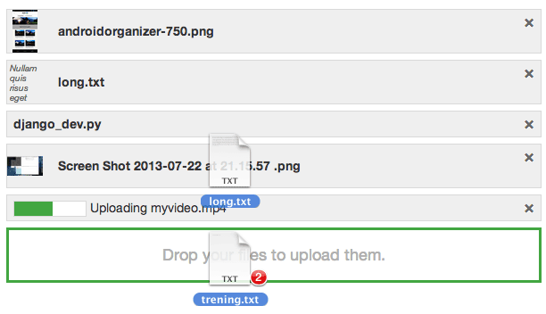
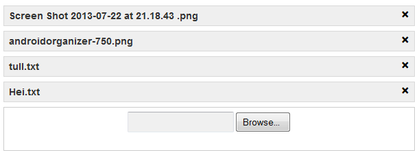

Overview
========

``devilry_file_upload`` makes it easy to use file upload in web applications
without forcing you to use a specific library or a specific UI design. We provide
an API, :doc:`devilry_file_upload`, that abstracts away the differences
between modern and old browsers.

Instead of limiting the capabilities to the lowest common denominator, we make
it work on old browsers, while enabling you to create beautiful and powerful
widgets for modern browsers.

Sourcecode, bugs, and suggestions
=================================
The code is at our `GitHub project page
<https://github.com/devilry/devilry_file_upload>`_. Submit issues through the
github project page. Submit patches using github pull requests. You may want to
create an issue before creating a patch to minimize the risk of you patch being
rejected.

TOC
===

.. toctree::
   :maxdepth: 2

   intro
   examples
   devilry_file_upload
   jquerywidgets
   develop
   license

How it looks
============
The :doc:`jquerywidgets` API provides a set of widgets that you can use. They
are good examples of what you can build with the :doc:`devilry_file_upload`
API, and they can be used without modification as long as you have jQuery
available.

The widgets is designed to be styled by you, and we provide optional default
styles and layouts. One of the provided styles look like this on modern
browsers:

In older browsers, we gracefully fall back to using a plain file field. The
image below shows more or less the same view rendered in IE8. We have not
styled the form at all, but you can of course do so if you like:

Supported browsers
==================
Tested in IE8, IE9, IE10, Firefox 3.6+, Chrome, Safari and Opera. We do not use
any browser detection, but instead we rely on feature detection with graceful
fallbacks, so any somewhat modern browser should work.

The only unsupported browsers that any significant percent of users may still
use is IE7 and IE6. If you need to support those browsers, we feel really
*really* **really** sorry for you. If you really want support for those
browsers, you may want to hire us to develop a patch for you (see
:ref:`professional_support`).

.. _professional_support:

Professional support
====================
If you need more or faster support or help than we can provide for free through
the issue tracker, send an email to ``post@espenak.net``. If you want free
support, use the issue tracker.

Indices and tables
==================

* :ref:`genindex`
* :ref:`modindex`
* :ref:`search`
